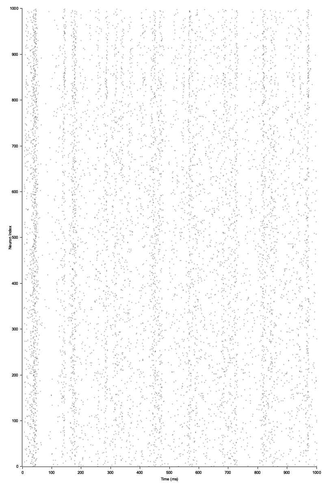

# Izhikevich Model Simulation

Izhikevich model in Rust, created for educational purposes, based on the paper [Simple Model of Spiking Neurons](https://www.izhikevich.org/publications/spikes.pdf).

It combines the simplicity of the Hodgkin-Huxley model with the computational efficiency of the integrate-and-fire model.

Below is the output of the simulation of 1000 neurons with the parameters from the paper - 800 excitatory and 200 inhibitory neurons over 1000ms.

As in the paper, we see the cortical-like firing pattern synchronous activity in the alpha and gamma range.



## Usage

# Default values
```bash
cargo run
```

# Custom parameters
```bash
cargo run -- --excitatory 500 --inhibitory 100 --milliseconds 2000
```
